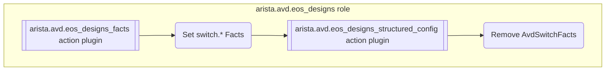

<!--
  ~ Copyright (c) 2023-2024 Arista Networks, Inc.
  ~ Use of this source code is governed by the Apache License 2.0
  ~ that can be found in the LICENSE file.
  -->

# Overview

## `eos_designs` high-level overview

AVD `eos_designs` works in two phases:

1. the fact phase: This phase is run once for all the devices in the fabric. All the input variables for all the devices are consumed to
   build a set of facts for each device. The facts of every device (and only the facts) can be accessed during the
   `structured_config phase` by devices which need them. This phase goal is to
   compute and expose the facts for the next phase.
2. the structured_config phase: This phase is run separately for each device.
   The available inputs are the `EosDesigns` class which contains the loaded
   input variable for the device as well as the facts for all devices.
   This phase goal is to generate the structured configuration for each device.

## Development steps

A strategy to shorten the runtime of the AVD collection / PyAVD for the users is
to pre-generate various object in advance and deliver them inside PyAVD so that
it does not have to be done at execution time (and on every execution). This
includes:

* Generate the schemas from the schema fragements and pickle them (for faster load).
* Compile the Jinja2 templates used.
* Generate the AVD classes from the schemas

### Jinja2 templates compiling

Jinja2 templates are compiled during development using the script
`python-avd/schema_tools/compile_templates.py`. The compiled schemas are stored
under `python-avd/pyavd/_<ROLE>/j2templates/compiled_templates`. These are
python files generated by the Jinja2 library which can be loaded faster when
executing Jinja2 (as loading a regular `j2` templates first step is to compile
it)

### Schema build

Schemas are built automatically from the schema fragments using the script
`python-avd/schema_tools/build_schemas`. The recommended way is to use either
`pre-commit` or to let it happen when running through Ansible.

The scripts:

1. gather all the fragments and combine them
2. stores the combined schemas as pickled schema on file for the next steps
3. validate the schemas
4. build the documentation tables from the scehmas. The tables are used in AVD documentation to document input variables.
5. build the AVD classes from the schemas.

### Schema to classes

Starting 5.2.0, AVD generates Python classes based on the schemas to load the
data in and use them as input / output for eos_designs role. The classes can be
found under the [AVD Classes](./avd_classes.md) section.

The code leveraged to build the classes from the schema is located under `python-avd/schema_tools/generate_classes`.

The classes are stored in `python_avd/pyavd/_<ROLE>/schema/__init__.py` and are used then by PyAVD to load the data.

!!! info

    Those files are pretty huged (30k+ line)
